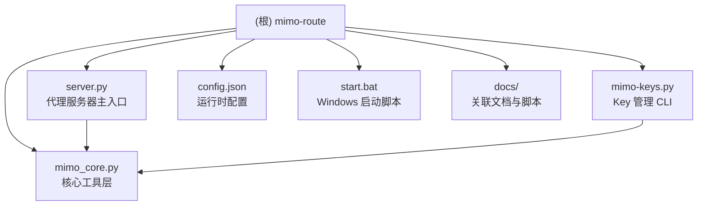

# CLAUDE.md

> 变更记录 (Changelog)
> - 2026-05-30 — 新增多模态路由、404 智能重试、模型回退机制
> - 2026-05-27 02:15:40 — 全量扫描重构，新增 Mermaid 模块结构图、覆盖率报告、文档体系完善

## 项目概述

MimoRoute 是一个本地反向代理服务器，将多个 Mimo API key 聚合成一个统一入口（默认 `localhost:18888`），自动选择可用 key 并转发请求到 CN/SGP 端点。

## 模块结构图



## 模块索引

| 文件 | 职责 | 依赖 |
|------|------|------|
| `server.py` | aiohttp 代理服务器，核心类 `MimoRoute`，处理所有 HTTP 请求转发 | `mimo_core.py`, `aiohttp` |
| `mimo_core.py` | 配置读写、Key 探测、状态码映射、状态更新（含归档逻辑） | `aiohttp` |
| `mimo-keys.py` | CLI 工具，提供 import / check / archive 命令管理 Key | `mimo_core.py`, `aiohttp` |
| `config.json` | 运行时配置（gitignored，含 API key） | — |
| `config.example.json` | 配置模板 | — |
| `start.bat` | Windows 启动脚本，自动释放端口并启动 | — |
| `requirements.txt` | 依赖声明：`aiohttp>=3.9.0` | — |
| `docs/` | 关联文档与脚本（CTF 代理、反代方案等） | — |

## 常用命令

```powershell
python server.py                    # 启动服务
.\start.bat                         # 启动脚本（自动检查依赖、释放端口）

python mimo-keys.py check           # 检测所有 key 有效性
python mimo-keys.py check --dry-run # 仅显示结果，不更新配置
python mimo-keys.py import tp-xxxxx                       # 导入单个 key
python mimo-keys.py import key1 key2 key3                 # 批量导入（并行检测）
python mimo-keys.py import <base64字符串> --base64         # 强制 base64 解码（dHA 开头自动识别）
python mimo-keys.py archive          # 归档失效 key
```

## 架构

单文件 aiohttp 代理服务器（`server.py`），核心类 `MimoRoute`：

1. **请求入口** — `handle_request` 接收所有 HTTP 请求，校验 `Authorization` 头中的 `local_key`
2. **Key 选择** — round-robin 轮询所有可用 key，均匀分摊请求负载，失败自动跳下一个
3. **请求转发** — `_forward` 流式代理到目标端点（SSE chunk-by-chunk），透传客户端原始 request/response header（仅替换 Authorization）
4. **自动重试** — 非 200 响应按类型处理：401/403 标记 invalid，429+quota 标记 quota_exhausted，其余临时错误（404/429 限频等）不动状态
5. **热更新** — 通过文件 mtime 监控 `config.json` 变更，无需重启（2 秒检查间隔）
6. **后台刷新** — 每 30 秒探测所有 key 状态，恢复已修复的 key，仅在确定性失败时标记失效
7. **端点冷却** — 404 响应触发 10 秒冷却期，避免向故障端点堆积请求
8. **智能路由** — 检测到图片内容自动切换到 `mimo-v2.5` 模型，`-nothinking` 后缀自动转换为 `thinking: disabled`
9. **404 智能重试** — 404 时跳过同端点 key，自动尝试其他端点，支持递增等待重试（最多 3 次）
10. **模型回退** — 配置 `model_fallback` 链，当前模型失败时自动降级到下一个模型

## config.json 结构

- `apikeys.cn[]` / `apikeys.sgp[]` — key 列表，每个包含 `key`、`status`，失效时附带 `error_code` 和 `error_message`
- `local_key` — 本地代理认证密钥
- `endpoints.cn` / `endpoints.sgp` — 上游 API 地址
- `model_fallback[]` — 模型回退链，默认 `["mimo-v2.5-pro", "mimo-v2.5"]`
- `port` — 代理监听端口（默认 18888）
- `archive[]` — 归档的失效 key（由 `archive` 命令生成）

## Key 状态

`valid` → 正常使用 | `invalid` → 失效（自动标记或手动） | `disabled` → 手动禁用 | `quota_exhausted` → 额度用尽

服务器只使用 `status=valid` 的 key。运行时按 round-robin 轮询，非 200 响应按类型判断是否标记失效（404 等临时错误不会误判）。

## 依赖

仅 `aiohttp>=3.9.0`，Python 3.8+。

## 测试策略

当前无自动化测试。建议补充：
- 单元测试：`mimo_core.py` 中的 `code_to_status`、`update_key_status`、`decode_base64` 纯函数
- 集成测试：使用 `aiohttp.test_utils.AioHTTPTestCase` 测试代理转发逻辑
- 端到端测试：mock 上游端点验证重试与故障转移

## 编码规范

- Python 3.8+ 兼容，使用类型注解（`tuple[int, str] | None`）
- 异步优先：核心路径全部使用 `async/await`
- 日志使用标准 `logging` 模块，带轮转文件处理器
- 配置通过 JSON 文件管理，不使用环境变量（除 README 中提及的 `MIMO_CONFIG_PATH`）

## AI 使用指引

- 修改代理逻辑前，必须理解 `_forward` 的流式转发机制和 header 过滤规则（`_REQ_SKIP` / `_RESP_SKIP`）
- Key 状态流转：`valid` -> `invalid`/`quota_exhausted` -> 归档；恢复只从 `invalid`/`quota_exhausted` 回到 `valid`
- `disabled` 状态是终态，不受后台刷新影响
- 修改 `config.json` 结构时需同步更新 `config.example.json` 和 `mimo_core.py` 中的读写逻辑
